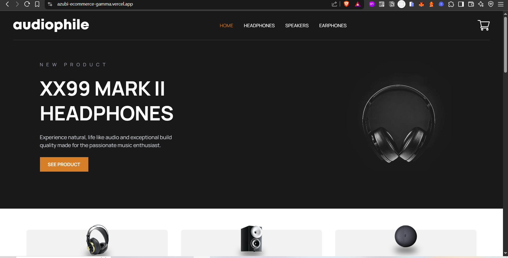
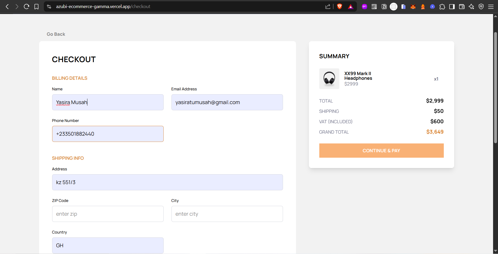
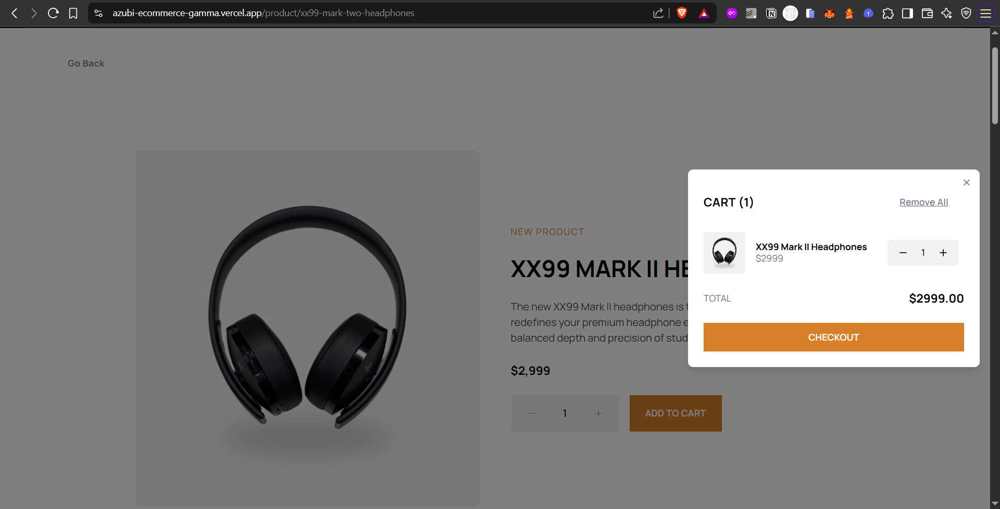
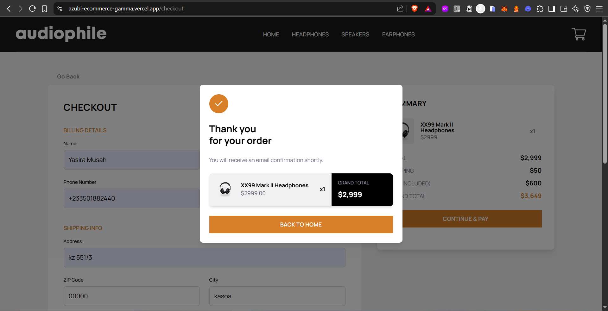

# 🛍️ E-Commerce Web Application – Azubi Talent Mobility Challenge

## 🚀 Project Overview

This is a multi-page e-commerce frontend application built as part of the **Azubi German Talent Mobility Program Assessment**. It demonstrates responsive UI not all are responsive, dynamic cart functionality, checkout flow, and data persistence — optimized for a seamless user experience across devices.

---

## 🧑‍💻 Technologies Used

- **React + Vite** – Fast frontend setup and modular architecture
- **Tailwind CSS** – Utility-first styling and responsive design
- **React Router** – Multi-page routing
- **Redux ToolKit** – Global state management for cart and checkout
- **LocalStorage** – Persist cart across sessions
- **Lucide Icons** – Svg Icons
  <!-- - **React Hook Form** – Form validation -->
  <!-- - **Framer Motion** (optional) – Smooth transitions and animations -->

---

## 📁 Folder Structure

```bash
public/                    # Static assets(images)
src/
├── assets/                # Static assets (images, logos)
├── components/            # UI components (buttons, modals, cards)
├── store/                 # Store for global state
├── data/                  # data.json file for product mock data
├── features/              # Features global slice
├── types/                 # Interface declaration
├── hooks/                 # Custom hooks
├── routes/                # Routes path
├── layouts/               # Layout definition
├── middleware/            # global middleware to local
├── pages/                 # Home, Category, Checkout, Product
├── utils/                 # Helper functions (VAT, shipping calculations, Validation)
├── App.tsx                # Application shell
└── main.tsx               # Vite entry point
```

---

## 🛠️ Features Implemented

- ✅ Fully responsive layout for all screen sizes
- ✅ Add, remove, and update items in the cart
- ✅ Real-time cart total updates
- ✅ Form validation on checkout (with visual error handling)
- ✅ Fixed shipping cost of `$50`
- ✅ VAT calculated at 20% of product total
- ✅ Confirmation modal with order summary
- ✅ **Cart state persists after page refresh** 🎉

---

## 📷 Screenshots

Here’s a preview of the homepage:






---

## 🌐 Live Demo

👉 [View Live Site Here](https://azubi-ecommerce-gamma.vercel.app/)

---

## 📎 GitHub Repository

👉 [View Codebase on GitHub](https://github.com/yasiramus/azubi-ecommerce.git)

---

## 📝 How to Run Locally

```bash
# Clone the repo
git clone https://github.com/yasiramus/azubi-ecommerce.git

# Navigate into the project
cd ecommerce-app

# Install dependencies
pnpm install

# Run the development server
pnpm run dev
```

---

## 📬 Submission Info

- **Email**: [your.email@example.com](mailto:yasiratumusah@gmail.com)
- **Hosted App**: \[[Vercel Link](https://azubi-ecommerce-gamma.vercel.app/)]
- **GitHub Repo**: \[[GitHub Link](https://github.com/yasiramus/azubi-ecommerce.git)]

---

## 🏁 Final Notes

This project was built with care and focus to meet the assessment requirements and showcase my frontend skills in a practical, user-friendly, and scalable way. Looking forward to the next phase of the Azubi Talent Mobility journey! 💼✨

<!-- yasira -->
